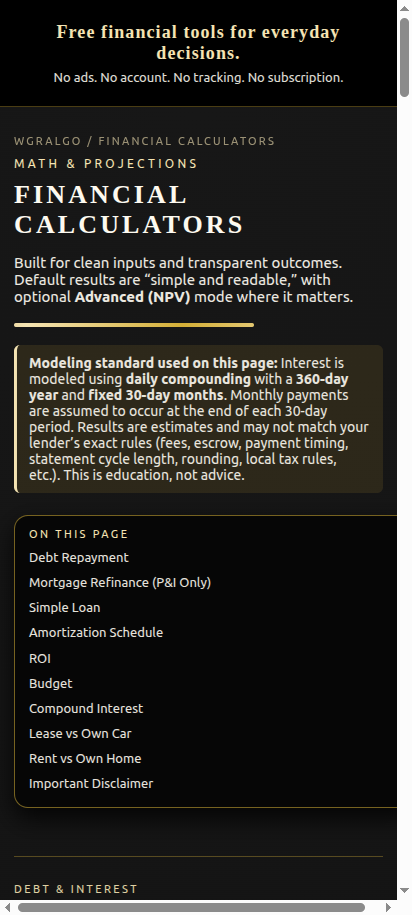
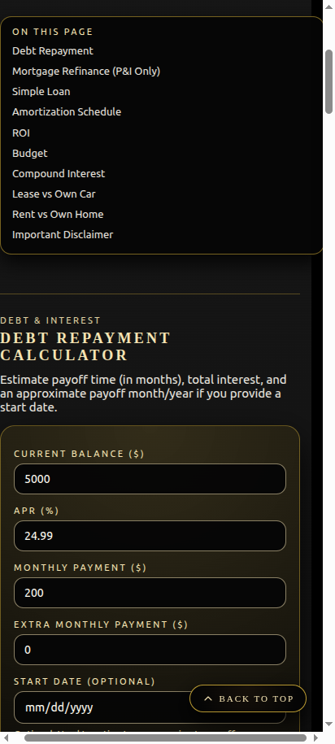
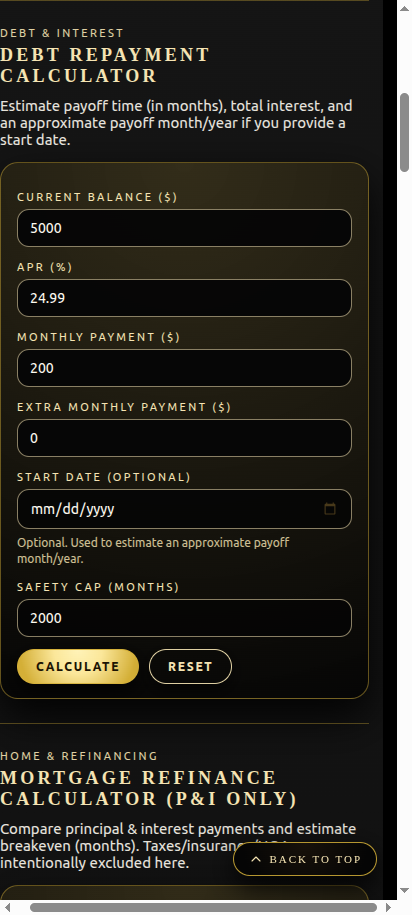
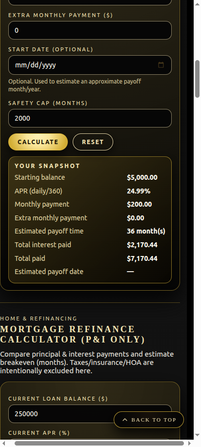
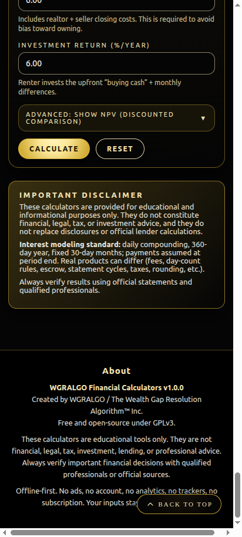

# WGRALGO Financial Calculators

WGRALGO Financial Calculators is a free, open-source Android APK that provides simple financial calculators for debt repayment, mortgage refinance estimates, simple loans, amortization schedules, ROI, budgeting, compound interest, lease vs own car comparisons, and rent vs own home comparisons.

The app is designed for serious people with limited resources who want practical tools without subscriptions, ads, accounts, or corporate money grabs.

The calculators are for educational and informational purposes only. They are not financial, legal, tax, investment, or lending advice.

## Calculators Included

- Debt Repayment
- Mortgage Refinance (P&I only)
- Simple Loan
- Amortization Schedule
- ROI (Return on Investment)
- Budget
- Compound Interest
- Lease vs Own (Car)
- Rent vs Own (Home)

## Privacy & Offline

WGRALGO Financial Calculators is offline-first.

- No ads.
- No account.
- No analytics.
- No trackers.
- No subscription.
- No cloud sync and no backend server.
- All calculator inputs stay on your device.
- The APK does **not** request the Android `INTERNET` permission.

See [PRIVACY.md](PRIVACY.md) for the full privacy statement.

## Installation (Sideloading)

1. Download `WGRALGO_Financial_Calculators_v1.0.0.apk` from the [v1.0.0 release](../../releases/tag/v1.0.0).
2. (Optional) Verify the download:
   ```
   sha256sum -c WGRALGO_Financial_Calculators_v1.0.0.apk.sha256
   ```
3. On your Android device, allow installation from unknown sources for your browser/file manager.
4. Open the APK and install.

> **If you installed an earlier test/debug build:** you may need to **uninstall the old APK first** before installing v1.0.0. This is because the official public APK uses a new proper release signature, and Android will refuse to install over a build signed with a different key.

## Disclaimer

These calculators are provided for educational and informational purposes only. They do not constitute financial, legal, tax, investment, or lending advice, and they do not replace disclosures or official lender calculations.

Interest is modeled using daily compounding with a 360-day year and fixed 30-day months; payments are assumed at period end. Real products can differ (fees, day-count rules, escrow, statement cycles, taxes, rounding, etc.). Always verify important financial decisions using official statements and qualified professionals.

## License

This project is licensed under the **GNU General Public License v3.0 (GPL-3.0-only)**. See [LICENSE](LICENSE).

Third-party dependencies remain under their own licenses — see [THIRD_PARTY_NOTICES.md](THIRD_PARTY_NOTICES.md).

## Credits

Created and maintained by **WGRALGO / The Wealth Gap Resolution Algorithm™ Inc.**

Project direction, testing, and public release decisions by **Richard "Rich" BlackMan / WGRALGO**.

Original web calculator code assistance by **ChatGPT by OpenAI**.

Android APK build and packaging assistance by **Claude Code by Anthropic**.

See [CONTRIBUTORS.md](CONTRIBUTORS.md).

## Screenshots

| Home | Calculators | Input |
|------|-------------|-------|
|  |  |  |

| Result | About / Privacy |
|--------|-----------------|
|  |  |

## Links

External websites are separate from the APK and may have their own privacy policies. The APK itself contains no external links, social media links, or donation links.

- Security reports: see [SECURITY.md](SECURITY.md)
