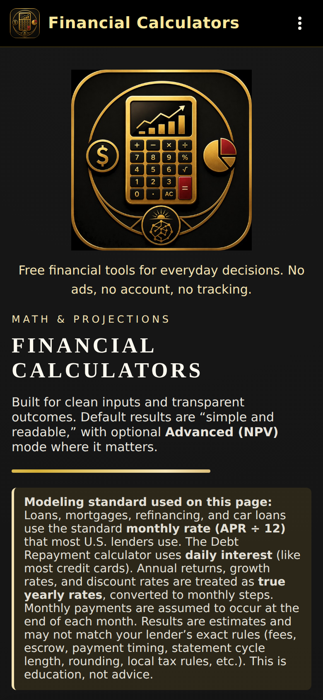
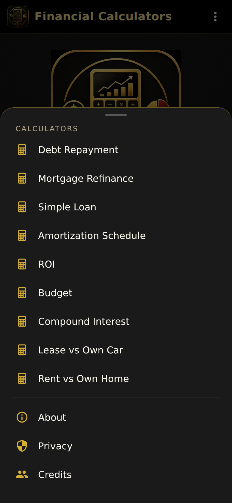
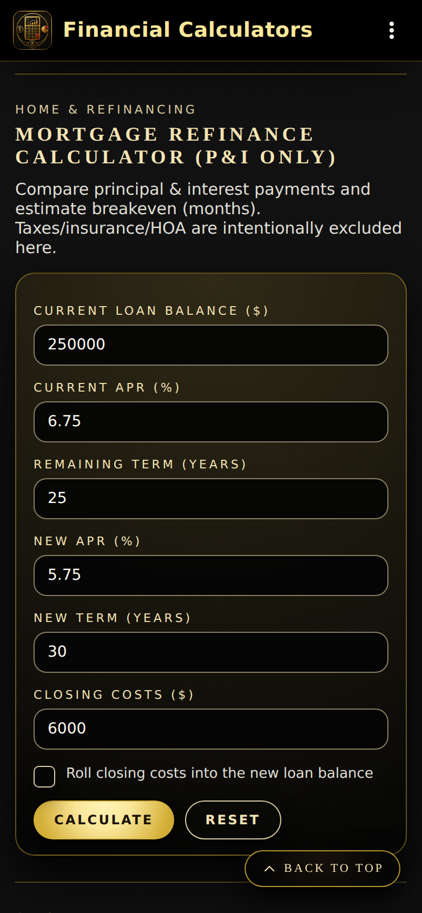
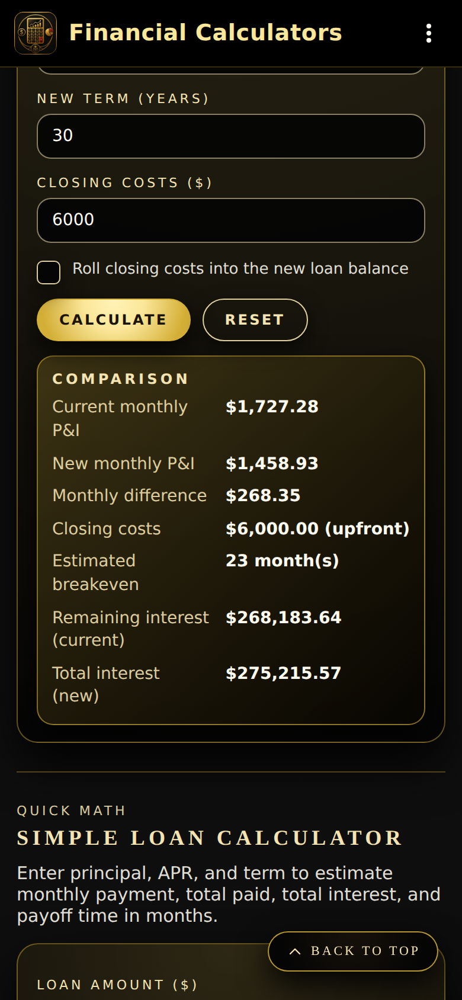
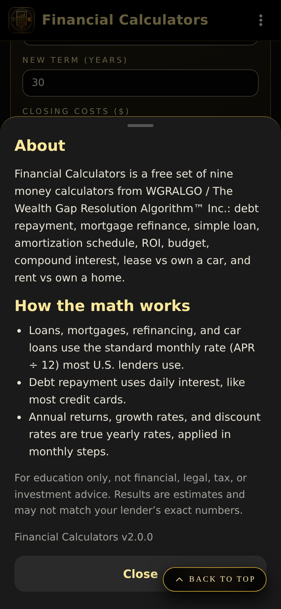
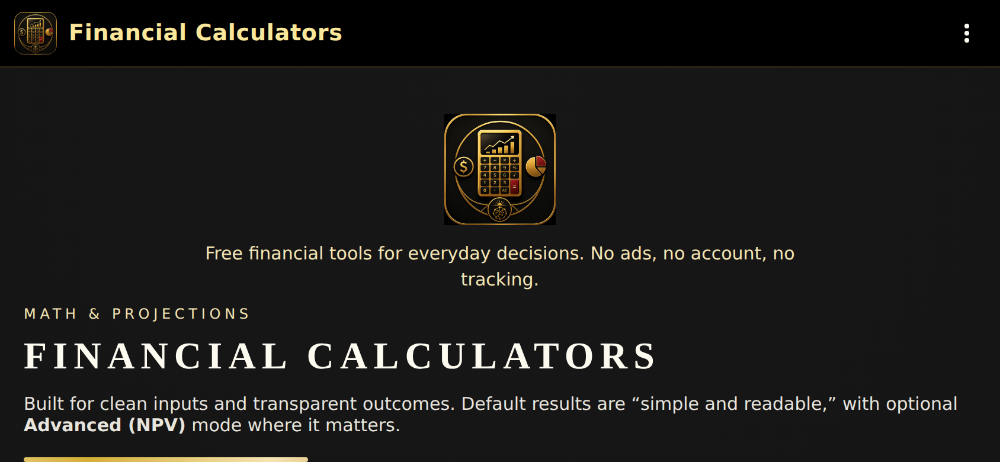
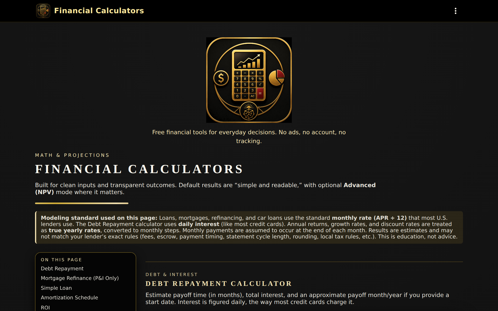
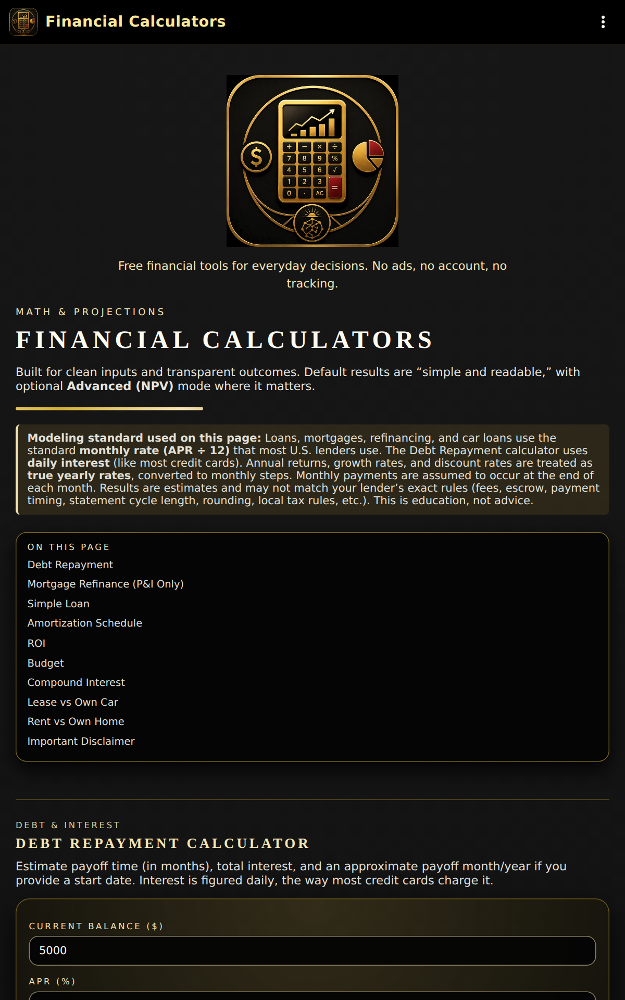

# WGRALGO Financial Calculators

Financial Calculators is a free, open-source educational Android app from **The Wealth Gap Resolution Algorithm™ Inc.** It gives you nine practical money calculators: debt repayment, mortgage refinance, simple loans, amortization schedules, ROI, budgeting, compound interest, lease vs own a car, and rent vs own a home.

The app is designed for serious people with limited resources who want practical tools without subscriptions, ads, accounts, or corporate money grabs.

The calculators are for educational and informational purposes only. They are not financial, legal, tax, investment, or lending advice.

- **Version:** 2.0.0
- **Devices:** phones and tablets, portrait and landscape
- **Package:** `org.wgralgo.financialcalculators`
- **License:** GPL-3.0-only

## Calculators Included

- Debt Repayment
- Mortgage Refinance (P&I only)
- Simple Loan
- Amortization Schedule (with CSV export)
- ROI (Return on Investment)
- Budget
- Compound Interest
- Lease vs Own (Car), with optional Advanced (NPV) mode
- Rent vs Own (Home), with optional Advanced (NPV) mode

## How the math works

- **Loans, mortgages, refinancing, and car loans** use the standard monthly rate (APR ÷ 12) that most U.S. lenders use.
- **Debt repayment** uses daily interest, like most credit cards.
- **Annual returns, growth rates, and discount rates** are true yearly rates, converted to monthly steps (7% means 7% a year).
- Payments are assumed at the end of each month. Results are estimates and may not match your lender's exact numbers.

## Features

- **Looks like a real app:** black launch screen with the big logo, a launcher icon that fills round, squircle, and square shapes, a solid app bar, a menu that jumps to any calculator, and About / Privacy / Credits panels.
- **Android back button:** closes menus and panels, scrolls back up to the top, and asks before exiting the app.
- **Phones and tablets, portrait and landscape:** the app rotates freely. On phones turned sideways the logo is smaller so the calculators start on screen; on tablets in landscape the calculator list stays on the side. Wide tables, like the amortization schedule, scroll inside their box.
- Offline-first: no `INTERNET` permission, no account, no cloud.

## Screenshots

| Launch | Home | Menu |
|------|------|------|
|  |  |  |

| Calculator | Result | About |
|------|------|------|
|  |  |  |

Phones and tablets:

| Phone, landscape | Tablet, landscape | Tablet, portrait |
|---|---|---|
|  |  |  |

## Privacy & Offline

Financial Calculators is offline-first.

- No ads.
- No account.
- No analytics.
- No trackers.
- No subscription.
- No cloud sync and no backend server.
- All calculator inputs stay on your device and nothing is saved after you close the app.
- The APK does **not** request the Android `INTERNET` permission (it is stripped from the final manifest), and a content security policy blocks all network access inside the app.

See [PRIVACY.md](PRIVACY.md) for the full privacy statement.

## Installation (Sideloading)

1. Download `WGRALGO-FinancialCalculators-v2.0.0.apk` from the [latest release](../../releases/latest).
2. (Optional) Verify the download:
   ```
   sha256sum -c WGRALGO-FinancialCalculators-v2.0.0.apk.sha256
   ```
3. On your Android phone or tablet, allow installation from unknown sources for your browser or file manager.
4. Open the APK and install.

> **Upgrading from v1.0.0?** Version 2.0.0 is signed with a new key and has a new app ID, so it can't install over the old app. Uninstall v1.0.0 first, then install v2.0.0. The app saves nothing on your device, so nothing is lost.

Signing certificate (v2.0.0 and later):

- `CN=WGRALGO, OU=Financial Calculators, O=The Wealth Gap Resolution Algorithm Inc, C=US`
- SHA-256: `FA:83:EA:DF:98:7D:23:7D:53:5B:FE:58:89:7A:31:E2:2F:CF:00:6B:1C:91:C6:26:01:BE:7C:41:60:7B:24:3B`

```
apksigner verify --print-certs WGRALGO-FinancialCalculators-v2.0.0.apk
```

## Build from Source

Requirements:
- Node.js 18+
- Android SDK (with build-tools and platforms)
- JDK 17

```
git clone https://github.com/WGRALGO/WGRALGO-Financial-Calculators.git
cd WGRALGO-Financial-Calculators
npm install
npx cap sync android
cd android
./gradlew assembleRelease
```

A release keystore is required for a signed APK. Reference it via `android/keystore.properties` (never committed):

```
storeFile=/absolute/path/to/your-release.p12
storePassword=YOUR_PASSWORD
keyAlias=financial-calculators
keyPassword=YOUR_PASSWORD
```

or the env vars `FC_KEYSTORE_FILE`, `FC_KEYSTORE_PASSWORD`, `FC_KEY_ALIAS`, `FC_KEY_PASSWORD`. The signed APK will be at `android/app/build/outputs/apk/release/app-release.apk`.

Check a build before publishing:

```
bash tools/validate-release.sh android/app/build/outputs/apk/release/app-release.apk
```

The launcher icon, splash images, and in-app logo are generated from `assets/icon.png` with `python3 tools/build-icons.py` (run from the repo root).

## Continuous integration and releases

- [`.github/workflows/android.yml`](.github/workflows/android.yml) builds a debug APK on every push and pull request.
- [`.github/workflows/release.yml`](.github/workflows/release.yml) builds, validates, signs, and publishes `WGRALGO-FinancialCalculators-v<version>.apk` with its `.sha256` to GitHub Releases. Run it from the **Actions** tab or push a `v*` tag. It needs these repository secrets: `FC_KEYSTORE_BASE64`, `FC_KEYSTORE_PASSWORD`, `FC_KEY_ALIAS`, `FC_KEY_PASSWORD`.

## Disclaimer

These calculators are provided for educational and informational purposes only. They do not constitute financial, legal, tax, investment, or lending advice, and they do not replace disclosures or official lender calculations.

Real products can differ (fees, day-count rules, escrow, statement cycles, taxes, rounding, etc.). Always verify important financial decisions using official statements and qualified professionals.

## License

This project is licensed under the **GNU General Public License v3.0 (GPL-3.0-only)**. See [LICENSE](LICENSE).

Third-party dependencies remain under their own licenses — see [THIRD_PARTY_NOTICES.md](THIRD_PARTY_NOTICES.md).

## Credits

Created and maintained by **WGRALGO / The Wealth Gap Resolution Algorithm™ Inc.**

Project direction, testing, and public release decisions by **Richard "Rich" BlackMan / WGRALGO**.

Original web calculator code assistance by **ChatGPT by OpenAI**.

Android APK build, calculator fixes, and packaging assistance by **Claude Code by Anthropic**.

See [CONTRIBUTORS.md](CONTRIBUTORS.md).

## Links

External websites are separate from the APK and may have their own privacy policies. The APK itself contains no external links, social media links, or donation links.

- Project page: https://thewealthgapresolutionalgorithm.org/financial-calculators/
- Security reports: see [SECURITY.md](SECURITY.md)
